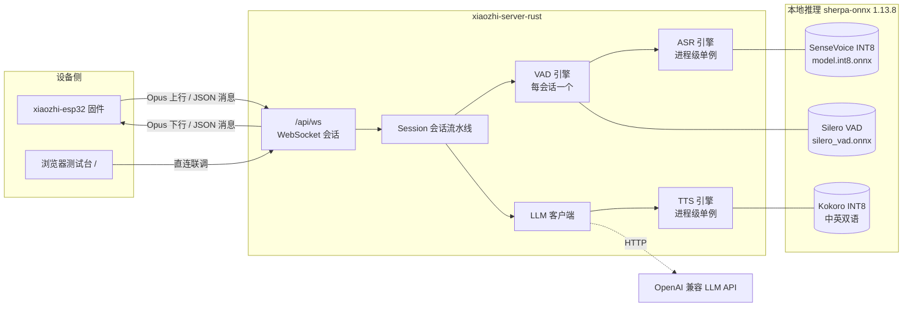
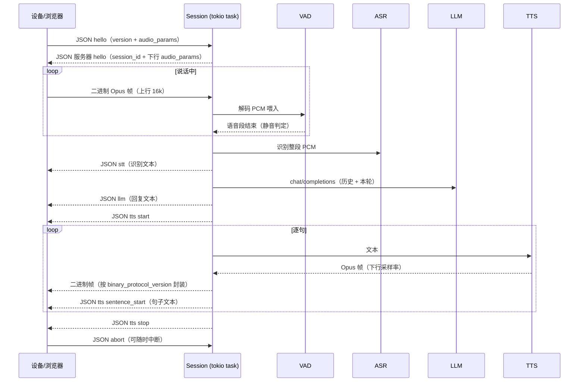

# xiaozhi-server-rust 项目架构文档

> Rust 实现的小智（xiaozhi-esp32）语音服务端：WebSocket 对接设备固件，本地离线 ASR / TTS（sherpa-onnx），远程 LLM（OpenAI 兼容 HTTP）。单二进制、零外部服务依赖（除 LLM API），默认特性可零配置跑通 mock 全链路。

> 📌 模块级职责与复杂逻辑以 `server/src/*.rs` 顶部的 `//!` 模块注释为**权威说明**（配置加载优先级、协议二进制封装、引擎线程预算、`/api/config` 读写语义等均已下沉到源码）。本文档仅保留跨模块的高层架构、部署与扩展指引，并链接到对应源码。

---

## 1. 总体架构



- **进程级单例**：ASR / TTS 模型重（数百 MB），由 `Engines` 在启动时加载一次，所有会话共享（`Arc<dyn Trait>`）。
- **每会话 VAD**：VAD 是流式有状态对象，`Engines::new_vad()` 为每个 WebSocket 会话创建独立实例。
- **双后端抽象**：ASR / TTS / LLM / VAD 均以 trait 抽象，`backend = "mock" | "sherpa" | "http"` 由配置切换，mock 后端支持零模型联调。

---

## 2. 目录结构

```
xiaozhi-server-rust/
├── server/                      # Rust 服务端（见下述 src/ 各模块）
│   └── src/
│       ├── main.rs          # 入口：配置加载优先级（XIAOZHI_CONFIG > --config > 内置 mock 默认）
│       ├── ws.rs            # HTTP 路由、握手协商、鉴权、/api/config 读写、管理页静态托管
│       ├── session.rs       # 单 WS 连接的会话状态机与语音流水线（含 abort、spawn_blocking）
│       ├── protocol.rs      # 文本 JSON 消息（serde 小写 tag）+ 二进制封装 v1/v2/v3
│       ├── engine.rs        # 进程级共享引擎集合 + 每会话 VAD 工厂 + TTS 语言池
│       ├── asr.rs / tts.rs / vad.rs / llm.rs  # 四大引擎 trait 与 mock/sherpa 实现
│       ├── audio/           # opus 编解码（audiopus）、线性重采样（rubato）
│       └── config.rs        # TOML 配置结构与加载（serde）
├── client/                      # Kuikly 多端工程（管理后台 web + macOS 测试台）
├── docker-entrypoint.sh         # 容器入口：模型自检 + 自动下载（GitHub Release 整包 + GITHUB_PROXY）
├── scripts/download_models.sh    # 宿主机预置模型（与入口同源 URL）
├── config.example.toml          # 配置样例（[server]/[audio]/[asr]/[vad]/[tts]/[llm]）
├── Dockerfile                   # rust:1.90 多阶段构建，RUSTFLAGS=-C target-cpu=x86-64-v2
└── docker-compose.yml           # xiaozhi + xiaozhi-mock（profile）两个服务
```

> 各模块的**职责、复杂逻辑与陷阱以 `server/src/*.rs` 顶部的 `//!` 模块注释为权威说明**，
> 例如协议二进制封装见 `protocol.rs`、配置优先级与 `/api/config` 语义见 `main.rs`/`ws.rs`、
> 引擎线程预算见 `engine.rs`。下文仅保留跨模块的高层说明。

---

## 3. 会话流水线（一轮对话）



要点：

- **上行**：设备发 Opus（16k 单声道），服务端解码 → 重采样（如需）→ 喂 VAD；VAD 判定说话结束后把整段 PCM 交给 ASR（非流式识别，SenseVoice 为离线模型）。
- **下行**：LLM 回复 → TTS 逐句合成 → 按协商的下行采样率（默认 24k）编码 Opus → 按 `binary_protocol_version` 封装下发。
- **abort**：设备可随时发 `abort` 中断播报，会话立即停止剩余合成。

> 会话状态机与流水线实现细节（上行/下行处理、`spawn_blocking` 隔离重推理、abort 中断、下行帧补齐逻辑）见 `../server/src/app/session.rs` 模块注释（权威说明）。

---

## 4. 协议设计（对齐 xiaozhi-esp32 固件）

### 4.1 文本消息（JSON）

- serde 枚举使用 `#[serde(tag = "type", rename_all = "snake_case")]`，与固件的小写 `type` 标签严格一致（`hello`/`listen`/`abort`/`mcp` 等单词变体仍为纯小写）；多单词变体为蛇形（如网页测试台的 `asr_test`、`tts_test`）。
- 握手：首条消息必须是文本 `hello`（非文本/非 hello 直接断开）；服务器回 hello 携带 `session_id` 与下行 `audio_params`。
- 上行协议版本跟随设备 `hello.version`；下行版本由服务端 `binary_protocol_version` 决定。
- 网页测试台专用消息（不影响设备协议）：
  - `asr_test`（`action: start/stop`）：录音开始/结束后对整段缓冲一次性 ASR（跳过 VAD），结果以 `stt` 回包；
  - `tts_test`（`text` + 可选 `lang/speaker/speed`）：文本直接合成下发（跳过 ASR/LLM），复用 `tts start → sentence_start → 二进制帧 → stop` 序列。

> serde 小写 `type` 标签是 AI 易踩的运行时陷阱（`cargo check` 无法发现），排查见 `../agents.md` §5.1；枚举定义与字段见 `../server/src/app/protocol.rs`。

### 4.2 二进制帧（Opus 包封装）

二进制帧的字节布局（v1/v2/v3）、`wrap_downlink` / `unwrap_uplink` 的出口约束，已作为**权威说明**写入 `../server/src/app/protocol.rs` 模块注释（含完整字节序表格）。`protocol.rs` 是唯一的封装/解封装出口；浏览器测试台按同样规则嗅探（首字节特征判定 v2/v3，否则视为 v1）。

### 4.3 HTTP 端点

| 路径 | 说明 |
|---|---|
| `GET /` | 静态托管管理页面（h5App 构建产物，`[server].admin_dir` 指向；目录缺失时返回友好提示，见 `../server/src/app/ws.rs`） |
| `GET /api/health` | 健康检查，返回 `xiaozhi-server-rust ok` |
| `GET /api/ws` | WebSocket 会话入口 |

> 全部 HTTP 端点、鉴权（`?token=` 兜底）与 `/api/config` 读写语义，见 `../server/src/app/ws.rs` 模块注释（权威说明）。

鉴权：`[server].expected_token` 非空时，设备走 `Authorization: Bearer <token>` 请求头；浏览器 WebSocket 无法自定义请求头，额外支持 `?token=` 查询参数兜底。

---

## 5. 关键设计决策

1. **feature 门控编译**：Cargo feature `sherpa`（默认关闭）引入 sherpa-onnx 依赖；`default = []` 仅 mock，CI 与本地联调零模型即可编译运行。`cfg(feature)` 同时门控 `audiopus_sys`（本地 opus 或 autotools）。
2. **构建目标指令集**：Docker 构建 `RUSTFLAGS="-C target-cpu=x86-64-v2"`——部署机 N5105（Tremont）无 AVX，禁止 `native`（CI 机构建会把 AVX 嵌进二进制，部署时 SIGILL）。
3. **API 版本锁定**：sherpa-onnx Rust crate 锁定 1.13.8（`create(&config)` 返回 `Option`、`get_result()` 在 stream 上、`generate_with_config` 需显式回调类型等，见 agents.md §5）。
4. **模型文件名**：官方包内为 `model.int8.onnx`（非 `model.onnx`）；Kokoro 使用 `kokoro-int8-multi-lang-v1_1`（中英双语完整包，含 lexicon-zh / dict / espeak-ng-data）。
5. **容器首启自动下载**：`docker-entrypoint.sh` 自检关键模型文件，缺失则从 k2-fsa/sherpa-onnx 官方 GitHub Release 下载整包 tar.bz2 并解压到挂载的 `/data/models`（默认走 `GITHUB_PROXY` 代理）；开关 `XIAOZHI_AUTO_DOWNLOAD_MODELS = missing | force | off`，下载失败中止启动。
6. **配置回退链**：`XIAOZHI_CONFIG` 环境变量 → `--config` 参数 → 内置 mock 默认配置，任何一级失败告警后回退，保证进程总能起来（便于零配置联调）。加载优先级与 env 覆盖语义见 `../server/src/main.rs` 模块注释。
7. **并发模型**：每个 WS 连接一个 tokio task（session），引擎跨会话共享；音频编解码均为纯函数，无共享可变状态。并发与 CPU 预算细节见 `../server/src/engine.rs` 模块注释。
8. **CPU 占用上限**：tokio worker（默认 2，`[server].worker_threads`）+ ASR 识别（`[asr].num_threads`=2）+ TTS 合成（`[tts].num_threads`，默认 4）+ VAD（1），各段错峰执行，峰值控制在 4 核内为小主机留余量；容器侧由 `docker-compose.yml` 的 `cpus:"3.5"` 限核。线程预算设计见 `../server/src/engine.rs`。

---

## 6. 配置体系（config.example.toml）

> 权威字段、默认值与 mock/sherpa 门控语义见 `../server/src/config.rs`；完整样例见 `../server/config.example.toml`。

| 段 | 关键项 | 说明 |
|---|---|---|
| `[server]` | `port`、`expected_token`、`worker_threads` | 监听端口（永远绑 0.0.0.0）、Bearer 鉴权（空 = 不校验）、tokio worker 线程数 |
| `[audio]` | `downlink_sample_rate`、`downlink_frame_duration_ms`、`binary_protocol_version` | 下行音频参数，写入服务器 hello |
| `[asr]` | `backend`（mock/sherpa）、`model`、`tokens`、`language`、`num_threads` | SenseVoice 离线识别 |
| `[vad]` | `model`、`threshold`、`min_silence_duration` | Silero VAD 切段 |
| `[tts]` | `backend`、`model`、`voices`、`tokens`、`data_dir`、`dict_dir`、`lexicon`、`lang`、`speaker`、`speed` | Kokoro 合成（中英）；`lang` 建模时固定，测试台切语言按需另建引擎 |
| `[llm]` | `backend`（mock/http）、`api_base`、`api_key`、`model`、`system_prompt`、`max_history` | OpenAI 兼容接口 |

---

## 7. 部署架构

```mermaid
flowchart TB
    subgraph 宿主机 NAS
        CFG[config.toml]
        MODELS[./server-data 挂载]
        subgraph 容器 xiaozhi-server-rust
            EP[docker-entrypoint.sh<br/>自检/下载模型]
            BIN[/app/server]
        end
    end
    GH[GitHub: k2-fsa/sherpa-onnx Releases]

    EP -- "1. 检查 /data/models 关键文件" --> MODELS
    EP -- "2. 缺失则从 GitHub Release 下载整包并解压" --> GH
    EP -- "3. exec" --> BIN
    CFG -. 挂载 :ro .-> BIN
    MODELS -. 挂载 :rw .-> BIN
```

- 镜像：`rust:1.90-bookworm` builder + `debian:bookworm-slim` runtime（运行期装 `libopus0 curl bzip2`）。
- mock 服务：`docker compose --profile mock up`，`XIAOZHI_CONFIG=/dev/null` 回退内置 mock，零模型联调。
- 部署后浏览器直接访问 `http://<host>:8000/` 即是测试台（同源自动填充 WS 地址与 `?token=`）。

---

## 8. 测试体系

| 层级 | 工具 | 覆盖 |
|---|---|---|
| 单元测试 | `cargo test` | 协议 v1/v2/v3 二进制封装往返、JSON 序列化 |
| 协议联调 | `tests/mock_client.py` | 零依赖 WS 客户端，断言 hello → stt → llm → tts 全链回包 |
| 端到端 | `client/apps/macosApp`（`@Page("test")`） | macOS 真实麦克风 ASR + 扬声器 TTS（原生桥接 XiaoZhiModule；Opus 编解码仍为 TODO） |
| 部署验证 | ACR CI 构建 | Docker 多阶段构建（x86-64-v2 指令集） |

---

## 9. 扩展指引

- **新增 ASR/TTS 后端**：实现 `asr.rs` / `tts.rs` 中的 trait，在 `build_asr` / `build_tts` 按 `backend` 字段分支返回。
- **新增消息类型**：在 `protocol.rs` 的 `ClientMessage` / `ServerMessage` 枚举加变体（注意小写 tag），`session.rs` 的 switch 补处理；配套更新网页测试台与 mock_client 断言。
- **更换 LLM**：`llm.rs` 的 `LlmClient` 只依赖 OpenAI 兼容 chat/completions，改 `api_base` 即可接任意兼容服务。
